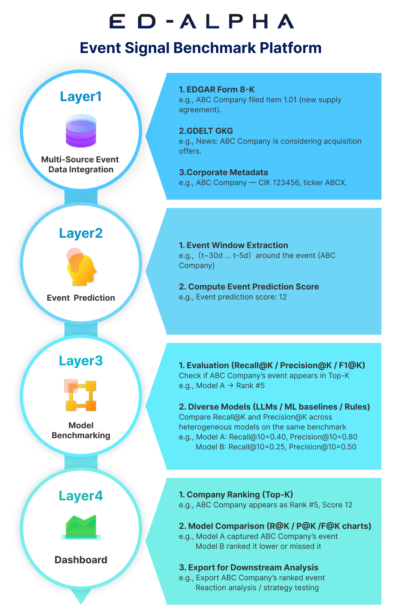
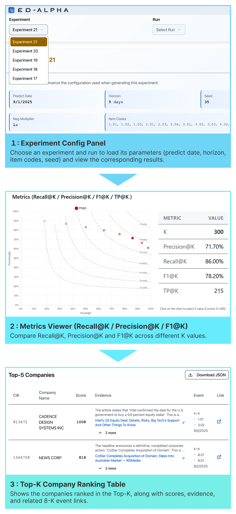

<p align="center">
  
</p>

<p align="center">
  
</p>

# ED-Alpha

ED-Alpha is a Python 3.12.11 pipeline that ingests SEC filings and GDELT news, links articles to companies, scores event importance with LLMs, and evaluates recall@k / precision@k against actual filing events. The project combines a batch data pipeline with a lightweight demo UI.

## Overview

- Pipeline steps: (1) sync SEC company data and filings to build labels, (2) ingest GDELT GKG news and link them to companies, (3) score article importance with an LLM, (4) aggregate run-level scores to extract likely events and measure metrics.
- Tech stack: Python 3.12.11, PostgreSQL, OpenAI Chat Completions API, FastAPI demo backend, Vite/PNPM frontend.

<p align="center">
  
</p>

## Docker quickstart

Run the full stack with Docker Compose v2 (`docker compose …`): Postgres + backend (FastAPI) + frontend (Next.js) + batch runner.

### 1) Prepare environment variables (.env)
```bash
cp .env.sample .env
# Edit as needed
USER_EMAIL=you@example.com
PGHOST=localhost
PGPORT=5432
PGDATABASE=postgres
PGUSER=postgres
PGPASSWORD=postgres
PGSSL=disable
OPENROUTER_API_KEY=xxx        # only if you need it
NEXT_PUBLIC_API_BASE_URL=http://localhost:8000
```

### 2) Build and start
The first start applies `db/*.sql` automatically when the DB volume is empty.
```bash
docker compose build --no-cache
docker compose up -d db                 # wait until healthy
docker compose up -d backend frontend   # ports: backend 8000 / frontend 3000
```
- Backend docs: http://localhost:8000/docs  
- Frontend: http://localhost:3000

### 3) Run batch jobs
Keep the batch container up and use a shell for multiple scripts:
```bash
docker compose --profile batch up -d batch
docker compose exec -it batch sh
cd /app/src
python fetch_recent_filings.py
python fetch_gdelt_master_times.py
# run other scripts as needed, then exit
```
One-shot example:
```bash
docker compose run --rm batch python src/fetch_recent_filings.py
```

## Batch Pipeline

Run the scripts below (e.g., inside the batch container at `/app/src`) to populate and evaluate the dataset. CLI options from `JPN_README.md` remain available for customization.

1) Sync company tickers.
```bash
python src/fetch_company_tickers.py
```
2) Fetch latest filings from SEC bulk data.
```bash
python src/fetch_recent_filings.py
```
3) Pull GDELT master times (e.g., hourly intervals).
```bash
python src/fetch_gdelt_master_times.py --start-date 20250101 --end-date 20250131
```
4) Download and store GDELT GKG records for the desired window.
```bash
python src/fetch_gdelt_gkg.py --start-time 202501010000 --end-time 202501020000
```
5) Link GDELT organizations to companies.
```bash
python src/link_gdelt_gkg_companies.py
```
6) Generate labels for filings by Item code.
```bash
python src/generate_labels.py \
  --predict-date 20251001 \
  --horizon-days 30 \
  --item-codes 1.01 1.02 1.03 2.01 2.03 2.04 3.01 3.02 3.03 4.02 5.01 5.03 8.01
```
7) Score linked GDELT news with the LLM.
```bash
python src/score_gdelt_news.py \
  --experiment-id 123 \
  --min-days-before 60 \
  --max-days-before 1 \
  --batch-size 200 \
  --run-label "baseline-score" \
  --model gpt-4o-mini
```
8) Aggregate per-run scores by CIK.
```bash
python src/aggregate_gdelt_run_scores.py --run-id 42
```
9) Calculate recall@k / precision@k metrics.
```bash
python src/calc_gdelt_run_metrics.py --run-id 42 --k-values 10 25 50 100
```
10) (Optional) Scrape filing item sections for inspection.
```bash
python src/scrape_filing_items.py --experiment-id 123 --delay 0.5
```

Tip: use `config/predict_config.example.json` as a template and pass `--config` to re-use the same parameters across runs. Add `--dry-run` to reporting scripts to log without writing.

## UI

<p align="center">
  
</p>

The demo UI shows filing predictions and news scores backed by the batch outputs.

Run with Docker (see Docker quickstart):
- Backend: http://localhost:8000/docs
- Frontend: http://localhost:3000

---
